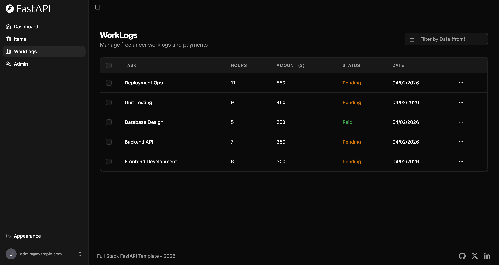

## Full Stack: WorkLog Payment Dashboard

### Applicant Information
- **Name**: [Your Name]
- **Email**: [Your Email]

---

## 📋 Assessment Summary

This is my submission for the Senior Full Stack Developer assessment. I've built a complete WorkLog Payment Dashboard with the following features:

### ✅ Requirements Implemented

| Requirement | Status |
|-------------|--------|
| List all worklogs with earnings per task | ✅ Complete |
| Drill down into worklog to see time entries | ✅ Complete |
| Select date range to filter worklogs | ✅ Complete |
| Review selection before confirming payment | ✅ Complete |
| Exclude specific worklogs or freelancers | ✅ Complete |

---

## 🛠️ Technology Stack

- **Backend**: FastAPI, SQLModel, Pydantic
- **Frontend**: Next.js 14, React 18, TypeScript
- **Database**: PostgreSQL 15
- **Infrastructure**: Docker, Docker Compose

---

## 🚀 How to Run

```bash
docker compose up
```

- **Frontend**: http://localhost:5173
- **API Docs**: http://localhost:8000/docs

---

## 📸 Screenshots

### Dashboard


### Worklogs List


### Worklog Detail with Time Entries


### Payment Processing - Date Filter


### Payment Processing - Exclusions


### Payment Confirmation Modal


### Payment History


---

## 📁 Project Structure

```
├── backend/           # FastAPI backend
│   ├── app/
│   │   ├── models/    # SQLModel database models
│   │   ├── routers/   # API endpoints
│   │   └── main.py    # Application entry point
│   └── Dockerfile
├── frontend/          # Next.js frontend
│   ├── src/
│   │   ├── app/       # Pages (Dashboard, Worklogs, Payments)
│   │   ├── components/# React components
│   │   └── lib/       # API client & utilities
│   └── Dockerfile
├── docker-compose.yml # Container orchestration
├── init.sql           # Database schema & seed data
└── screenshots/       # UI screenshots
```

---

## 🔧 Key Features

1. **Modern Dark UI** - Glassmorphism design with smooth animations
2. **Responsive Layout** - Works on desktop and tablet
3. **Real-time Preview** - Payment totals update as you select/exclude items
4. **Date Range Presets** - Quick filters for common periods
5. **Confirmation Modal** - Prevents accidental payment processing
6. **Comprehensive Seed Data** - 5 freelancers, 10 worklogs, 25+ time entries

---

## 💡 Design Decisions

- Used **SQLModel** for clean ORM with Pydantic validation
- Implemented **date-based filtering** at the API level for efficiency
- Created **reusable components** for cards, filters, and modals
- Added **exclusion tracking** both at worklog and freelancer level
- Used **CSS custom properties** for consistent theming
